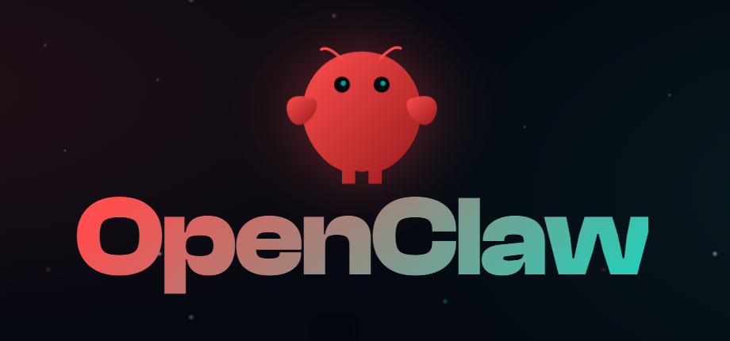

<div align="center">




# OpenClaw Kali Offensive Security Agent

### AI-Powered Offensive Security Agent Framework for Kali Linux


</div>

---

## 🚀 Overview

OpenClaw is an AI-powered autonomous agent framework designed to run on **Kali Linux**, enabling:

- AI-assisted reconnaissance  
- Automated tool orchestration  
- OSINT pipelines  
- Controlled red team automation  
- Telegram-controlled execution  
- Agentic security research  

Built for **authorized security research, labs, and educational environments only.**

---


# OpenClaw Kali Offensive Security Agent

AI-powered autonomous agent framework running on Kali Linux for
offensive security research, red team automation, OSINT, reconnaissance,
and tool orchestration.

------------------------------------------------------------------------

## ⚠ Legal & Ethical Notice

This repository and setup are intended strictly for **authorized**
security testing, red team exercises, security research, CTF challenges,
and educational purposes in controlled lab environments.

Any unauthorized use, including against systems without explicit written
permission, is illegal and unethical.

------------------------------------------------------------------------

## Table of Contents

-   [Project Overview](#project-overview)
-   [Lab Environment Requirements](#lab-environment-requirements)
-   [Pre-Installation Checklist](#pre-installation-checklist)
-   [Installation Steps](#installation-steps)
-   [Configuration](#configuration)
-   [Network & Firewall Configuration](#network--firewall-configuration)
-   [Service Management](#service-management)
-   [Testing & Validation](#testing--validation)
-   [Common Errors & Fixes](#common-errors--fixes)
-   [Security Hardening
    Recommendations](#security-hardening-recommendations)
-   [Directory Structure](#directory-structure)
-   [Automation Suggestions](#automation-suggestions)
-   [Cleanup / Uninstallation](#cleanup--uninstallation)
-   [References](#references)

------------------------------------------------------------------------

## Project Overview

**OpenClaw** is an open-source AI agent framework that enables
autonomous agents to:

-   Execute terminal commands\
-   Interact with the operating system\
-   Browse the web\
-   Use search APIs\
-   Orchestrate security tools via natural language instructions

When deployed on **Kali Linux**, it becomes a powerful, remotely
controllable offensive security workstation capable of:

-   AI-assisted reconnaissance & OSINT at scale\
-   Automated subdomain enumeration + vulnerability scanning pipelines\
-   Telegram-controlled red team tooling\
-   Rapid prototyping of custom attack workflows\
-   Educational red team / purple team labs\
-   Research into agentic AI applied to offensive security

------------------------------------------------------------------------

## Lab Environment Requirements

### Hardware (VPS or Local Hypervisor)

  Component   Minimum       Recommended
  ----------- ------------- ---------------------------
  vCPU        4             8
  RAM         8 GB          16--32 GB
  Storage     50 GB SSD     100+ GB SSD
  Network     Public IPv4   Public IPv4 + good uplink

### Software

-   Kali Linux 2025.x rolling release
-   Root or passwordless sudo access
-   Node.js ≥ 22

------------------------------------------------------------------------

## Pre-Installation Checklist

``` bash
sudo apt update && sudo apt full-upgrade -y && sudo apt autoremove -y
sudo apt install -y curl git nano ufw apt-transport-https ca-certificates
```

You will also need:

-   OpenRouter API key\
-   Tavily API key (optional)\
-   Telegram Bot token\
-   Telegram user ID

------------------------------------------------------------------------

## Installation Steps

### Connect to Kali

``` bash
ssh -i ~/.ssh/your_key root@your-kali-vps-ip
```

### Harden SSH

``` bash
sudo nano /etc/ssh/sshd_config
```

Set:

    PasswordAuthentication no
    PermitRootLogin prohibit-password

Restart:

``` bash
sudo systemctl restart ssh
```

### Install OpenClaw

``` bash
npm install -g openclaw@latest
openclaw onboard
```

Follow the wizard:

-   Gateway mode → local\
-   Bind address → 127.0.0.1\
-   Port → 1515\
-   LLM Provider → OpenRouter\
-   Enable Telegram channel\
-   Add your Telegram user ID to allowlist\
-   Enable security-related skills

------------------------------------------------------------------------

## Configuration

Main directory:

    ~/openclaw/

### Key Files

  File                 Purpose
  -------------------- ---------------------
  agents.md            Prompts and rules
  .env / config.json   API keys and tokens
  skills/              Agent capabilities

### OPSEC System Prompt (Add to agents.md)

``` markdown
You are an offensive security research agent running on Kali Linux.

Strict rules:
- Never delete or overwrite files without confirmation
- Prefer --dry-run modes
- Do NOT exfiltrate data without instruction
- Log every executed command
- Maintain strict OPSEC
```

------------------------------------------------------------------------

## Network & Firewall Configuration

``` bash
sudo ufw allow from YOUR_HOME_IP to any port 22 proto tcp
sudo ufw default deny incoming
sudo ufw default allow outgoing
sudo ufw enable
```

Gateway must listen only on:

    127.0.0.1:1515

------------------------------------------------------------------------

## Service Management

Create:

``` bash
sudo nano /etc/systemd/system/openclaw-gateway.service
```

``` ini
[Unit]
Description=OpenClaw Gateway - AI Offensive Security Agent
After=network.target

[Service]
Type=simple
User=root
WorkingDirectory=/root/openclaw
ExecStart=/usr/bin/node gateway.js
Restart=always
RestartSec=10

[Install]
WantedBy=multi-user.target
```

Enable:

``` bash
sudo systemctl daemon-reload
sudo systemctl enable openclaw-gateway
sudo systemctl start openclaw-gateway
```

------------------------------------------------------------------------

## Testing & Validation

Send to Telegram:

    Wake up agent.

Example tasks:

    Perform passive OSINT on target.example.com
    Run nmap top 1000 ports simulation on 192.168.1.100
    Enumerate subdomains of example.org

------------------------------------------------------------------------

## Common Errors & Fixes

  Symptom                Likely Cause         Fix
  ---------------------- -------------------- -----------------------------
  npm not found          Node missing         sudo apt install nodejs npm
  No Telegram response   Token issue          Re-run onboarding
  Rate limits            Free tier exceeded   Upgrade plan
  Skill not found        Not installed        Install plugin

------------------------------------------------------------------------

## Security Hardening Recommendations

-   Use dedicated low-privilege user
-   Rotate API tokens
-   Enable audit logging
-   Restrict egress firewall
-   Never expose port 1515 publicly

------------------------------------------------------------------------

## Directory Structure

    ~/openclaw/
    ├── agents.md
    ├── .env
    ├── skills/
    ├── gateway/
    ├── logs/
    └── node_modules/

------------------------------------------------------------------------

## Automation Suggestions

``` bash
#!/bin/bash
set -e
apt update && apt full-upgrade -y
apt install -y curl git nano ufw nodejs npm
npm install -g openclaw@latest
```

------------------------------------------------------------------------

## Cleanup / Uninstallation

``` bash
sudo systemctl stop openclaw-gateway || true
sudo systemctl disable openclaw-gateway || true
sudo rm -f /etc/systemd/system/openclaw-gateway.service
sudo systemctl daemon-reload

rm -rf ~/openclaw
npm uninstall -g openclaw || true
```

------------------------------------------------------------------------

## References

-   https://www.npmjs.com/package/openclaw\
-   https://github.com/openclaw/openclaw\
-   https://docs.openclaw.ai/\
-   https://openrouter.ai/docs\
-   https://docs.tavily.com\
-   https://www.kali.org/docs/\
-   https://core.telegram.org/bots

------------------------------------------------------------------------

For authorized red team research and controlled lab environments only.
